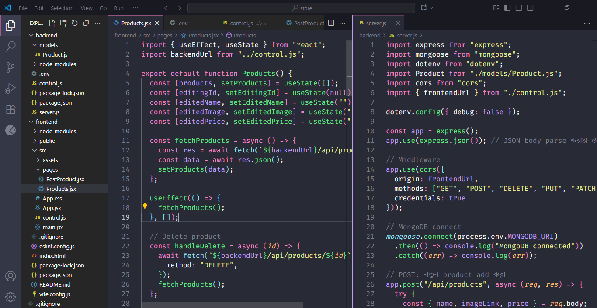

<div align="center">


</div>

<h3 align="center">Full Stack <b>Store</b> website</h3>

This is a full-stack project built with **React (Vite)** on the frontend and **Express + MongoDB (Mongoose)** on the backend. The project supports full **CRUD operations** (Create, Read, Update, Delete) for products. This is my first MERN website 16 sep, 2025.

### To run this project localy:
Clone Repository
``` bash
git clone https://github.com/codeovik/my-first-mern.git
```

Go root directory
``` bash
cd my-first-mern
```

Go **frontend** folder, install dependencies fro front end and return root directory
``` bash
cd frontend
npm i
cd ..
```

Go **backend** folder, install dependencies fro front end and return root directory
``` bash
cd backend
npm i
cd ..
```

Make ```.env``` file in **backend** folder

Run front end
``` bash
cd frontend
npm run dev
```

Run back end
``` bash
cd backend
npm run start
```